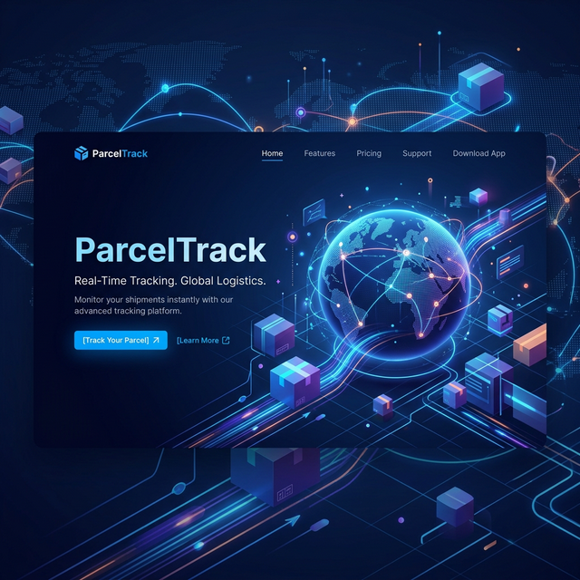
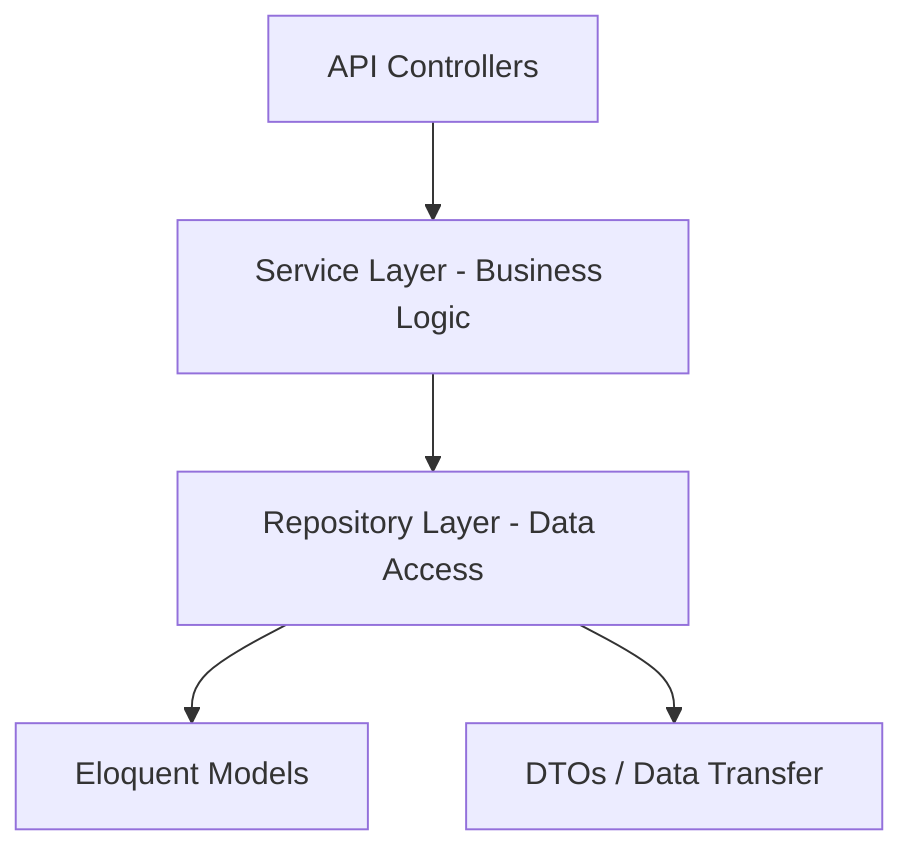

# 📦 ParcelTrack — Mini Logistics Tracking System



[](https://nextjs.org/)
[](https://laravel.com/)
[](https://tailwindcss.com/)
[](https://www.mysql.com/)

**ParcelTrack** is a professional full-stack logistics simulation that mimics a 3PL (Third-Party Logistics) parcel tracking system. This project demonstrates a production-ready architecture using **Laravel 11** for the backend and **Next.js 14** for the frontend, following best practices in software engineering.

---

## 🚀 Quick Links

- [Project Goals](#-project-goals)
- [Main Features](#-main-features)
- [Technology Stack](#-technology-stack)
- [System Architecture](#-system-architecture)
- [Installation Guide](#-installation-guide)
- [API Documentation](#-api-documentation)

---

## 🎯 Project Goals

The primary objective of this project is to showcase core professional engineering competencies:

- **Fullstack Mastery**: Integration of a high-performance PHP backend with a modern React frontend.
- **Clean Architecture**: Implementation of **Separation of Concerns (SoC)** through Service and Repository patterns.
- **Modern UI/UX**: Creating a "wow" factor with premium glassmorphism designs and smooth interactions.
- **Scalability**: Designing database schemas and API layers that are robust and extensible.

---

## ✨ Main Features

### 🌐 Public Portal

- **Real-time Tracking**: Instant search using tracking numbers (`PT-XXXXXXXX`).
- **Visual Delivery Timeline**: Interactive history showing the parcel's journey through various hubs.
- **Detailed Information**: View weight, description, and origin/destination warehouse details.

### 🔐 Admin Management

- **Analytics Dashboard**: High-level metrics for parcels (In Transit, Delivered, Pending).
- **Parcel Lifecycle**: Full CRUD for parcels with strict status transition rules.
- **Warehouse Operations**: Manage and monitor warehouse locations across Indonesia.
- **Courier Management**: Track active couriers assigned to delivery tasks.

---

## 🛠 Technology Stack

### **Frontend**

| Tool                | Purpose                                     |
| :------------------ | :------------------------------------------ |
| **Next.js 14**      | Modern React Framework with App Router      |
| **Tailwind CSS v4** | Utility-first CSS with next-gen performance |
| **ShadCN UI**       | Premium, accessible UI components           |
| **TanStack Query**  | Server state management and caching         |
| **Zod**             | Schema-based validation for forms           |

### **Backend**

| Tool                     | Purpose                                 |
| :----------------------- | :-------------------------------------- |
| **Laravel 11**           | Powerful PHP Web Framework              |
| **Laravel Sanctum**      | Secure API Token-based authentication   |
| **Spatie Query Builder** | Declarative API filtering and sorting   |
| **Swagger UI**           | Interactive API documentation (OpenAPI) |
| **MySQL**                | Robust relational data storage          |

---

## 🏗 System Architecture

### **Backend Layers**



### **Frontend Layers**

- **Pages**: Next.js App Router structure.
- **UI Components**: Atomic design with ShadCN and Tailwind.
- **Hooks**: Custom TanStack Query hooks for modular data fetching.
- **Services**: Centralized Axios instances for API communication.

---

## 📂 Folder Structure

```text
ParcelTrack/
├── backend/            # Laravel 11 Source Code
│   ├── app/            # Business logic, Repositories, Services
│   ├── routes/         # API Route definitions
│   └── database/       # Migrations and Seeders
├── frontend/           # Next.js 14 Source Code
│   ├── app/            # Pages and Layouts
│   ├── components/     # UI and Feature components
│   └── hooks/          # API-integrated custom hooks
├── database/           # MySQL Exports (.sql)
└── assets/             # Brand identity and media
```

---

## ⚙️ Installation Guide

### **1. Prerequisites**

Ensure you have the following installed:

- PHP >= 8.2
- Node.js >= 18
- Composer
- MySQL

### **2. Backend Setup**

```bash
cd backend
composer install
cp .env.example .env
php artisan key:generate
```

**Database Configuration:**
Update `.env` with your local MySQL credentials:

```env
DB_CONNECTION=mysql
DB_DATABASE=parcel_track
DB_USERNAME=root
DB_PASSWORD=YOUR_PASSWORD
```

**Migrate & Seed:**

```bash
php artisan migrate --seed
```

### **3. Frontend Setup**

```bash
cd frontend
npm install
npm run build # or npm run dev
```

**Environment:**
Create `frontend/.env.local`:

```env
NEXT_PUBLIC_API_URL=http://localhost:8000/api
```

---

## 📖 API Documentation

The system automatically generates interactive documentation using Swagger.

- **URL**: `http://localhost:8000/api/documentation`
- **Auth**: Use the Bearer Token from the login endpoint.

---

## 🔑 Demo Credentials

Access the admin portal to manage operations:

- **URL**: `http://localhost:3000/admin/login`
- **Email**: `admin@parceltrack.com`
- **Password**: `password123`

---

## 👨‍💻 Author

**Ilham Malik**

- GitHub: [ial07](https://github.com/ial07)
- LinkedIn: [Ilham Malik](https://linkedin.com/in/ilham-almalik)

---

_Developed with ❤️ as a logistics simulation._
